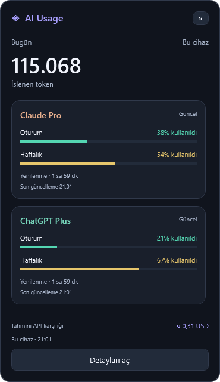

# AI Usage Viewer

A local, open-source Windows widget for AI token usage, subscription quotas and
API spend. Independent C# / .NET 10 / WPF codebase, licensed under MIT.

**Pre-release:** Windows x64, initially targeting Windows 11. This is not yet a
fully validated stable v1.0. Observed tests and remaining release gates are in
[implementation evidence](docs/IMPLEMENTATION_STATUS.md).

## Türkçe hızlı başlangıç

Portable ZIP'i bir klasöre çıkarıp **AIUsageViewer.exe** dosyasını aç veya
**Setup.exe** paketini kullan. .NET SDK kurman gerekmez. Claude/Codex için ilgili
resmî CLI uygulamasında giriş yapmış olmalısın. Ayarlardan bulunan kaynak
klasörlerini kontrol et; hesap profilini seçip **Bağlantıyı dene** ile doğrula.
OpenRouter anahtarını uygulamanın ayarlarına yaz; sohbet veya issue içinde paylaşma.

Widget, tray paneli ve detay ekranı aynı yerel veritabanından beslenir. Pencereyi
kapatmak uygulamayı tray'de bırakır. Tam kapatma: tray menüsü → **Çıkış**.
Token toplamı, abonelik kotası ve tahmini API karşılığı farklı ölçümlerdir.
Widget her zaman bugünün cihaz toplamını gösterir; detay ekranındaki filtreler
widget'ın toplamını değiştirmez.

## Features

- Desktop widget, notification-area panel and analytics window.
- Incremental Claude Code and Codex JSONL collection, SQLite history and deduplication.
- Input/output/cache breakdown; today, last seven days, month and all-history filters.
- Model/project/session drill-down, trend chart and thirteen-week activity grid.
- Claude subscription quota through an experimental OAuth usage adapter.
- Codex subscription quota through the official local app-server RPC.
- OpenRouter key limits/spend, permission-dependent account credits and separate
  completed-day activity history. Partial permissions preserve available data.
- Exact-model, source-dated pricing and per-model overrides. Unknown prices stay
  unknown. CSV/JSON exports contain usage metadata, not conversations or secrets.
- Multiple profiles, widget card ordering/visibility, compact display, remaining/
  used mode, optional cost, dark/light themes, opacity and Turkish/English.
- Optional quota/reset/low-balance notifications and Windows startup.
- Current-user DPAPI for API keys; no app account, telemetry or hosted backend.



The image uses synthetic data. Real account data is not included in the repository.

## Installation and data

The portable ZIP and per-user installer include the .NET runtime. Extract the
entire ZIP; do not move only the executable. Verify the archive against
`SHA256SUMS.txt`. Initial artifacts are unsigned.

User data defaults to `%LOCALAPPDATA%\AiUsageViewer`, independently of the install
directory. `--data-dir PATH` selects another location. DPAPI credentials remain
bound to the current Windows user even in portable mode. Uninstall retains data.
Back up the data directory with the app closed; never share it publicly.

Local sources honor `CLAUDE_CONFIG_DIR` and `CODEX_HOME` during discovery. Review
the discovered folders in Settings; multiple profile folders can be added.
Authentication is handled by the official CLI, not by the viewer. OpenRouter
history requires management permissions. See [provider details](docs/providers/README.md).

## What the numbers mean

Local token totals cover records on this device. Account quotas may include web
and other-device activity. Percentages come from providers; token counts are not
converted into guessed subscription quota. Old forked Codex events without stable
identity are excluded from verified totals and their count is shown.

Estimated API equivalent is a calculation using the selected current tariff,
including for older events. It is not the subscription bill or a reconstructed
historical invoice. Bundled prices cover exact model IDs and standard short-context
rates; long context, priority/fast/batch and other billing modifiers are not inferred.
Source dates and unknown model coverage are visible. User overrides take precedence.

OpenRouter key spend, account balance and account history stay separate. Multiple
keys' account balances are never summed. Activity provides the last thirty completed
UTC days; the viewer retains older days only after it has observed them.

## Build, test and package

Development requires Windows and the SDK in `global.json`. Provider accounts are
not required for build/test/demo. Reference repositories are not dependencies.

```powershell
dotnet restore AiUsageViewer.slnx
dotnet build AiUsageViewer.slnx -c Release --disable-build-servers -m:1 -p:UseSharedCompilation=false
./scripts/test.ps1
dotnet run --project src/AiUsageViewer.App -c Release -- --demo
./scripts/package.ps1 -Iscc 'C:\path\to\Inno Setup\ISCC.exe'
./scripts/package-source.ps1
```

Packages are written to `artifacts/release`. Omitting `-Iscc` builds the portable
ZIP only. The workflow creates artifacts; it does not automatically publish a
GitHub release. Contribution and privacy details: [CONTRIBUTING](CONTRIBUTING.md),
[SECURITY](SECURITY.md), [third-party licenses](THIRD_PARTY_NOTICES.md).
The optional source archive contains the current Git working tree, including
uncommitted source changes, while excluding ignored local data and build output.

```powershell
dotnet run --project src/AiUsageViewer.App -c Release -- --demo --screenshot artifacts/screenshots --smoke-suite --data-dir local/demo
dotnet run --project src/AiUsageViewer.Diagnostics -c Release -- --scan --repeat --data-dir local/validation
dotnet run --project src/AiUsageViewer.App -c Release -- --validate-live --data-dir local/validation
```

Screenshot/smoke mode requires synthetic data and exits after rendering.
An existing unmarked database is rejected in demo mode; use a new empty directory.
Live UI validation reads configured profiles, writes a count/status-only report and exits
without private screenshots. It does not issue model requests or redeem quota.
It reports cached-data rendering separately from freshly fetched quotas; success
requires a fresh usable result for every enabled account.

For an extended read-only background observation, use a separate local data
directory. Normal watchers and refresh intervals remain active; the command
records resource counters, dispatcher delay and provider states, then exits.
It does not change startup settings, display private screenshots or send alerts.

```powershell
./scripts/observe.ps1 -Executable artifacts/publish/win-x64/AIUsageViewer.exe -DataDirectory local/runtime-check -Seconds 1800
```

This is a bounded observation, not evidence of overnight stability or physical
monitor/suspend testing. Reports are local diagnostics; do not publish them
without checking their metadata. Product scope: [original plan](docs/PLAN_TR.md).

## Project references

Product research included [Token Monitor](https://github.com/Javis603/token-monitor),
[AI Usage Tray](https://github.com/ShlomiPorush/ai-usage-tray),
[AI Usagebar](https://github.com/akitaonrails/ai-usagebar),
[Aimo](https://github.com/ouchanip/aimo) and
[AI Usage Tracker](https://github.com/Vesperino/ai-usage-tracker).
Their code/assets are not bundled. Their ideas informed the feature research;
the new app has its own adapters, storage and user interface.
