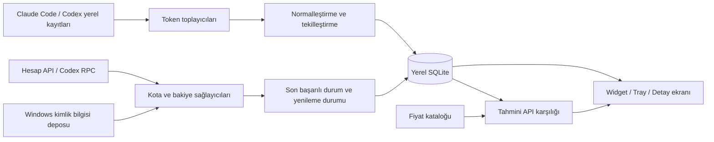

**AI Usage Viewer: Windows uygulaması için ürün ve geliştirme planı**

27 Eylül 2026. Çalışma adı: **AI Usage Viewer**. Bu belge geliştirme kapsamını ve kabul ölçütlerini tanımlar. Uygulama ayrı `app/` dizininde geliştiriliyor; tamamlanan işler ve kalan doğrulamalar [uygulama durumunda](IMPLEMENTATION_STATUS.md) izlenir. Önceki kaynak araştırması: [proje referansları](../README.md#project-references).

**1. Ürün hedefi ve temel kararlar**

Açık kaynak, yerel çalışan bir Windows widget’ı. Kullanıcı bir bakışta hem AI araçlarında harcadığı tokenları hem Claude/Codex aboneliklerindeki kalan kullanım hakkını görebilecek. Detay ekranında kullanımın hangi araç, model, proje ve oturumlardan geldiğini inceleyebilecek.

Token Monitor’un özellik zenginliğini ve görsel yaklaşımını referans alacağız. Yeni uygulamanın kendi kod tabanı, veri modeli, adı ve dağıtım süreci olacak. İncelenen projeleri kurmak veya çalıştırmak gerekmeyecek; sağlayıcıların kendi CLI’ları bazı bağlantılar için gerekebilecek.

| Konu | Planlanan karar |
|---|---|
| İlk platform | Windows x64; Windows 11 üzerinde ilk doğrulama. Desteklenen Windows sürümleri release testleriyle açıkça listelenecek. |
| Uygulama biçimi | Tray ikonu, masaüstüne sabitlenebilen widget, ayrı detay penceresi |
| Teknoloji | C# + .NET 10 + WPF, MVVM |
| Veri saklama | Yerel SQLite; tercihler ayrı ayar dosyası |
| Kimlik bilgileri | Windows Credential Manager veya kullanıcı kapsamlı DPAPI; ayarlarda sır yerine referans |
| İlk sağlayıcılar | Claude Code tokenları + Claude abonelik kotası; Codex tokenları + Codex abonelik kotası |
| İlk genişleme | OpenRouter anahtar kullanımı, bakiye ve harcama |
| Açık kaynak lisansı | MIT önerisi; doğrudan alınan kodların telif/lisans bildirimleri korunacak |
| Dil | Türkçe ve İngilizce |
| İlk çalışma modeli | Yerel kullanım, uygulama hesabı veya kendi bulut sunucumuz gerektirmeyen kurulum |

WPF seçiminin nedeni ilk ürünün Windows odaklı olması: pencere davranışı, tray, dosya izleme, HTTP, süreç yönetimi ve veri katmanını tek teknolojiyle yönetebiliriz. Saydam ve modern bir arayüz için Electron kullanmak zorunlu değil. Bu, ölçülmüş RAM üstünlüğü iddiası değildir. İşletim sisteminden bağımsız hesaplama kodunu WPF’den ayıracağız; olası başka platform kararı daha sonra verilecek. [WPF belgeleri](https://learn.microsoft.com/en-us/dotnet/desktop/wpf/overview/), [.NET 10](https://learn.microsoft.com/en-us/dotnet/core/whats-new/dotnet-10/overview)

Buradaki widget masaüstünde duran normal bir uygulama penceresidir. Win+W ile açılan Windows Widgets Board entegrasyonu sonraki olası yüzeylerden biri. [Microsoft Widgets açıklaması](https://learn.microsoft.com/en-us/windows/apps/design/widgets/)

**2. Birbirine karıştırılmayacak veriler**

| Veri | Cevapladığı soru | Esas kaynak | Ekran ifadesi |
|---|---|---|---|
| Token kullanımı | Bu cihazda/oturumda kaç token işlendi? | Araçların yerel kullanım kayıtları | Token kullanımı |
| Abonelik kotası | Hesaptaki kullanım penceresinin ne kadarı doldu? | Sağlayıcının hesap/kota servisi | Abonelik kullanımı |
| API harcaması | Sağlayıcı ne kadar API kullanımı raporluyor? | Yetkili kullanım/billing API’si | Sağlayıcı harcaması |
| Bakiye | Kullanılabilir kredi ne kadar? | Yetkili bakiye API’si | Bakiye |
| Tahmini maliyet | Bu tokenlar seçili API tarifesiyle ne eder? | Token miktarı × sürümlü fiyat kataloğu | Tahmini API karşılığı |

Yerel log kapsamı ile hesap kapsamı aynı değil. Başka cihazda veya sağlayıcının web arayüzünde tüketilen kullanım kotayı değiştirebilir, ama bu bilgisayardaki token listesinde bulunmayabilir. Arayüz bunu “Bu cihaz” ve “Hesap kotası” etiketleriyle açıklayacak.

Kota yüzdesini yerel token sayısından tahmin etmeyeceğiz. Hesap özeti ve yerel log toplamı aynı olayları kapsıyorsa birbirine eklenmeyecek. Sağlayıcı kotayı bildirmiyorsa durum bilinmiyor olarak kalacak; sıfıra çevrilmeyecek. Claude’un kendi belgeleri de tokenlardan hesaplanan tutarı tahmin olarak tanımlar ve abonelik kullanıcılarının faturasından ayırır. [Claude maliyet ve kullanım belgesi](https://code.claude.com/docs/en/costs)

**3. Üç arayüz yüzeyi**

**Mini widget:** Çalışırken açık kalacak küçük görünüm. Bugünkü token toplamı, isteğe bağlı tahmini API karşılığı, seçilmiş Claude/Codex kota göstergeleri ve en yakın reset bilgisi. Kullanıcı hangi kartların görüneceğini seçebilecek. Sürükleme, boyutlandırma, konum kilidi, üstte tutma, opaklık, tema ve monitör bazlı konum hatırlama olacak. Geçiş animasyonları kısa, gereksiz sürekli animasyonlar kapalı olacak.

**Tray paneli:** Tray ikonuna tıklayınca açılan hızlı bakış. Tüm bağlı hesaplar, kota pencereleri, son başarılı güncelleme, bağlantı durumu, elle yenileme ve detaylara geçiş. Kullanılan/kalan gösterimi kullanıcı tercihi olacak; tehlike rengi her iki durumda aynı doluluk anlamını koruyacak.

**Detay penceresi:** Widget’tan açılan daha geniş analiz ekranı. Ana görünüm, kullanım geçmişi, abonelikler, araçlar/modeller, projeler/oturumlar ve ayarlar. Yoğun grafikler bu pencerede olacak; mini widget okunabilir kalacak.

Temsili mini görünüm, canlı veri değildir:

```text
AI Usage Viewer                    Bugün
124.500 token                ≈ $2,18 API

Claude   Oturum %38  ·  Haftalık %54
         Oturum yenilenmesine 2 sa 10 dk
Codex    Oturum %21  ·  Haftalık %67
         Haftalık yenilenmeye 3 gün

Bu cihaz · Kota güncellendi: 2 dk önce
```

Pencere tasarımı tek bir sabit piksel ölçüsüne bağlı olmayacak. %100/%150/%200 ölçek, çoklu monitör, görev çubuğu konumu, uyku/uyanma ve monitör çıkarma davranışları test edilecek. Fare tıklamalarını arkaya geçirme özelliği eklenirse tray/kısayol üzerinden geri dönüş yolu bulunacak.

**4. İlk kullanılabilir sürümün kapsamı**

İlk kullanılabilir sürümün tamamlanması için **hem token takibi hem Claude/Codex abonelik kotaları** çalışmalı. Yalnızca güzel görünen örnek verili arayüz bu hedefi karşılamaz.

- Claude Code ve Codex yerel kaynaklarını bulma; otomatik bulunan klasörleri kullanıcıya gösterme ve ek klasör seçebilme.
- Bugün, son 7 gün, bu ay ve kaydedilmiş tüm geçmiş için token toplamları.
- Input/output/cache ayrımı; araç ve model kırılımı.
- Basit yerel oturum listesi ve veri kapsamı bilgisi.
- Claude ve Codex hesap kartları; sağlayıcının bildirdiği oturum/haftalık/model kapsamlı pencereler ve reset saatleri.
- Bir sağlayıcıya birden fazla hesap/profil bağlayabilecek veri modeli ve hesap seçimi.
- Gerçek, eski, yenileniyor, giriş gerekli, kısıtlandı ve desteklenmiyor durumları.
- Mini widget, tray paneli ve temel detay ekranı.
- Yerel SQLite geçmişi, yeniden başlatmada kayıtları koruma, Türkçe/İngilizce.
- Güncel sürümde desteklenen bağlantı ve log biçimlerinin açık listesi.

Tam analitik, tüm sağlayıcılar ve cihaz senkronizasyonu bu ilk teslim için gerekmiyor. Bunların sırası aşağıdaki yol haritasında belirli.

**5. Veri kaynakları ve bağlanma akışı**

| Entegrasyon | Token geçmişi | Kota / bakiye | İlk doğrulama |
|---|---|---|---|
| Claude | Claude Code yerel JSONL kullanım kayıtları | İncelenen projelerdeki OAuth kullanım kaynağını ayrı adapter olarak doğrulama | Kendi hesabındaki `/usage` ile aynı zaman aralığının karşılaştırılması |
| Codex | Yerel session/archived session kayıtları; yapılandırılmış `CODEX_HOME` | Yerel `codex app-server` üzerinden `account/rateLimits/read` | Resmî CLI görünümüyle ve farklı dönen pencere türleriyle kontrol |
| OpenRouter | İlk etapta API’nin sunduğu kapsam; yerel istemci kayıtları ayrıca | `/key`, yetki varsa `/credits`; geçmiş için `/activity` | Normal ve yönetim anahtarı yetkilerinin ayrı testleri |

Codex’in belgelenen `account/usage/read` hesabın token özetlerini de döndürebiliyor. Kullanılabilirliği teknik doğrulamada incelenecek; yerel proje/oturum verisinin yerine geçmeyecek ve onunla toplanmayacak. RPC alanlarının sürüme göre bulunmaması desteklenmeyen yetenek olarak ele alınacak. [Codex App Server](https://learn.chatgpt.com/docs/app-server)

Claude için token ölçümü ile abonelik kotasının bağlantısı ayrı kurulacak. Resmî OpenTelemetry token/cost metrikleri gelecekte alternatif collector olabilir; mevcut geçmişi kendiliğinden geri getirmez ve plan kotasının yerini tutmaz. İlk sürümde kullanıcıdan OTel servisi kurması beklenmeyecek. İncelenen OAuth endpointinin üçüncü taraflar için kararlı, genel API sözleşmesi olduğu varsayılmayacak; bu nedenle Claude kota erişimi ilk teknik doğrulamanın zorunlu konusu. [Claude monitoring](https://code.claude.com/docs/en/monitoring-usage)

Bağlanma akışı: sağlayıcı seçimi → mevcut profil veya anahtar tanımı → bağlantı testi → hangi verilerin okunabileceğini gösterme → hesap kartı. Kota için giriş gerektiğinde resmî CLI girişine yönlendirme yapılacak. Normal izleme model çağrısı üretmeyecek, reset kredisi harcamayacak ve aktif hesabı kendiliğinden değiştirmeyecek.

**6. Token Monitor’dan alınacak ürün fikirleri**

| Özellik | Planlanan aşama | Uygulamamızdaki karşılığı |
|---|---|---|
| Canlı token toplamı | İlk kullanılabilir sürüm | Yeni kullanım kaydı yazıldıktan sonra hızlı güncelleme |
| Abonelik limit kartları | İlk kullanılabilir sürüm | Claude/Codex ayrı hesap ve kota pencereleri |
| Gün/hafta/ay filtresi | İlk kullanılabilir sürüm | Tüm ekranlarda tutarlı tarih aralığı |
| Araç ve model kırılımı | İlk kullanılabilir sürüm | Input/output/cache ayrımı |
| Isı haritası ve trend grafikleri | Analitik aşaması | Kaydedilmiş geçmiş için günlük/haftalık görünüm |
| Proje/oturum detayları | Analitik aşaması | Token ve model özeti; konuşma içeriği saklamadan |
| Tahmini maliyet ve fiyat override | Analitik aşaması | Fiyat kaynağı/tarihi görünür; bilinmeyen fiyat sıfır sayılmaz |
| Özelleştirilebilir panel | Windows beta | Kart sırası, görünürlük, yoğunluk, tema ve opaklık |
| Bildirimler | Windows beta | Kota yüzdesi, reset ve bakiye için ayrı kurallar |
| Token hızı | Sonraki iyileştirme | Süre verisi varsa gerçek oran; yoksa etiketli aktivite hızı |
| Çoklu cihaz/hub | Windows sürümü sonrasında | Yeni kapsam olarak değerlendirilecek |
| WSL kayıtları | Windows beta sonrası doğrulama | Kullanıcının seçtiği dağıtım ve kaynaklar; ortak dosyaları çift saymadan |

Diğer referanslardan: ai-usage-tray’in katmanları ve Codex RPC yaklaşımı; ai-usagebar’ın sağlayıcı kataloğu, önbelleği ve geri çekilmesi; ai-usage-tracker’ın küçük pencere etkileşimi; aimo’nun isteğe bağlı tarayıcı köprüsü fikri. Lisanslı kod alınırsa kaynağı ve değiştirilmiş bölümler kayıt altına alınacak. ai-usage-tracker’ın lisansı netleşmeden kod/varlık aktarımı yapılmayacak.

**7. Teknik yapı**

Uygulama ayrı bir kod tabanında geliştirilecek. Referans depolar araştırma malzemesi; yeni uygulamanın derlenmesi ve çalışması bunlara bağlı olmayacak. İlk sürüm için tek .NET çözümü yeterli. Mikroservis, yerel HTTP sunucusu veya tarayıcı eklentisi gerekmiyor.



Planlanan katman yapısı aşağıdadır. Güncel uygulama `app/src` altında, testler `app/tests/AiUsageViewer.Tests` altında oluşturuldu:

```text
src/
  AiUsageViewer.Core/            Veri tipleri, hesaplama ve sağlayıcı sözleşmeleri
  AiUsageViewer.Application/     Toplama, yenileme, sorgulama ve bildirim akışları
  AiUsageViewer.Infrastructure/  JSONL, SQLite, HTTP/RPC, Windows secret store
  AiUsageViewer.App/             WPF, MVVM, widget ve tray
tests/
  AiUsageViewer.Core.Tests/
  AiUsageViewer.Infrastructure.Tests/
  Fixtures/                     Yapay veya anonimleştirilmiş örnekler
docs/
  providers/                    Kaynak biçimleri ve desteklenen yetenekler
```

Temel sözleşmeler:

- `IUsageCollector`: kullanım olaylarını okur; kaynak konumu ve ilerleme işaretini döndürür. Yerel log ve gelecekte API geçmişi ayrı uygulamalardır.
- `IQuotaProvider`: sağlayıcının mevcut kullanım pencerelerini döndürür. İki sabit yüzde alanına sıkıştırılmaz.
- `IBalanceProvider`: desteklenen hesaplarda parasal bakiye/kredi bilgisi sağlar.
- `ProviderCapabilities`: token geçmişi, kota, bakiye, gerçek harcama ve hesap özeti desteğini bildirir. Desteklenmeyen kart gösterilmez.
- `AccountProfile`: sağlayıcı, hesap/profil kimliği ve secret referansı taşır. Uygulama ayarlarına ham token yazılmaz.
- `UsageEvent`: araç, model, oturum, proje, kaynak, zaman ve ayrıştırılmış token sayaçlarını taşır.
- `QuotaWindow`: kapsam, ölçü birimi, kullanılan/kalan miktar, limit, reset ve veri zamanı gibi mevcut alanları taşır. Sağlayıcı yalnızca yüzde veriyorsa kesin token kapasitesi uydurulmaz.

SQLite’ta kullanım olayları, tarama ilerlemesi, hesap tanımları, kota anlık görüntüleri ve fiyat sürümleri tutulacak. Konuşma mesajları, kod içerikleri ve ham kimlik bilgileri veritabanına alınmayacak. Kota geçmişi uygulamanın gözlemlemeye başladığı andan itibaren oluşur; eski kotaları geriye dönük üretmek mümkün kabul edilmez.

Widget ve grafikler veritabanından okur. Pencereyi açmak API isteği veya tüm geçmişi yeniden tarama işlemi başlatmaz. Log takibi dosya değişimi bildirimi ve aralıklı kontrol ile; kota takibi bağımsız zamanlayıcı ile çalışır. Bir sağlayıcının yavaşlaması diğer hesapların güncellenmesini durdurmaz.

**8. Verinin doğru hesaplanması**

Bu ürünün en önemli kabul ölçütü toplamların doğru olmasıdır. Grafik sayısı bundan sonra gelir.

1. **Tekilleştirme:** Aynı dosya veya olay tekrar okunduğunda toplam artmamalı. Kaynak kimliği, oturum ve sağlayıcının olay kimliği birlikte değerlendirilecek. Resume/fork ve kopyalanmış kayıtlar için ayrı örnekler bulunacak; kimliği belirsiz olaylarda sınırlama görünür olacak.
2. **Kümülatif sayaçlar:** Oturum boyunca büyüyen toplamlar olay başına kullanım gibi toplanmayacak. Aynı akıştaki fark hesaplanacak; yeni oturum/sayaç sıfırlaması ayrı ele alınacak.
3. **Dosya yaşam döngüsü:** Yarım yazılmış son satır tekrar denenecek. Dosyanın küçülmesi, dönmesi ve ayrıştırıcı sürümünün değişmesi yönetilecek. Olayların kaydı ile okuma ilerlemesi aynı işlemde güncellenecek.
4. **Token sınıfları:** Input/output/cache/read/write alanları kaynakların anlamına göre eşlenecek. İç içe geçen sayaçlar iki defa eklenmeyecek; örneğin output içinde raporlanan reasoning ayrıca toplamı büyütmeyecek.
5. **Hesap ataması:** Yerel kayıtta hesap kimliği yoksa o anda açık hesaba otomatik atanmayacak. Kaynak kapsamı “bu cihaz / hesap bilinmiyor” olarak korunacak. Araç, model, API sağlayıcısı ve ödeme hesabı farklı alanlar olacak.
6. **Zaman:** Kayıtlar UTC saklanacak; gün/hafta filtresi kullanıcının saat dilimine göre hesaplanacak. Kota reseti sağlayıcının zamanından alınacak; her hesapta 5 saat/hafta penceresi olduğu varsayılmayacak.
7. **Eksik veri:** Eksik değer sıfır değildir. Son başarılı değer ile son yenileme girişiminin zamanı ayrı tutulacak. Hata olduğunda önceki değer, yaşı ve hata durumu birlikte gösterilecek.
8. **Kapsam:** Yerel log toplamı, API anahtarı toplamı ve hesap genel toplamı aynı metriğin üst üste toplanabilir parçaları sayılmayacak. Farklı cihazların veya web kullanımının yerel geçmişte bulunmayabileceği gösterilecek.
9. **Maliyet:** Fiyatlar sürümlü olacak. Eşleşmeyen model “fiyat bilinmiyor” görünür; ücretsiz sayılmaz. Tahmini API karşılığı ile sağlayıcının bildirdiği gerçek harcama ayrı kalır. Para hesabında ondalık türler kullanılacak.
10. **Dayanıklı yenileme:** Hesap başına tek aktif istek, sınırlı eşzamanlılık, iptal/timeout ve geri çekilme olacak. `Retry-After` dikkate alınacak. Uyku sonrası kontrollü yenileme yapılacak; biriken zamanlayıcılar istek fırtınası üretmeyecek.

Varsayılan kota sorgulama aralığı başlangıçta 5 dakika olarak değerlendirilecek; sağlayıcının kurallarına göre değişebilir. Kullanıcı manuel yenileyebilir, ancak istek sınırları korunur. Reset geri sayımı yerelde hesaplanır ve her saniye ağ isteği gerektirmez. Token ekranının güncelliği ise kaynak aracın kullanım kaydını ne zaman yazdığına bağlıdır; modelin her ürettiği token için canlı akış vaat edilmez.

**9. Geliştirme yol haritası**

Aşağıdaki sürüm numaraları planlama içindir. Takvim tahmini P0 sonunda, gerçek kaynaklar ve hedef makinedeki ilk ölçümler görüldükten sonra yapılmalı.

| Aşama | Teslim | Tamamlanma ölçütü |
|---|---|---|
| **P0 — Veri doğrulaması** | Küçük doğrulama aracı; Claude/Codex kayıt örnekleri; iki sağlayıcıda salt okunur kota denemesi; bağlantı notları | Seçilen örneklerde token toplamları açıklanabiliyor; yetkili test hesaplarında kotanın kapsamı ve reseti resmî görünümle karşılaştırılabiliyor; Claude bağlantısının çalışabilirliği net |
| **P1 — Uygulama temeli** | WPF çözümü; SQLite; kaynak/hesap modeli; tray, widget ve detay ekranı iskeleti; Türkçe/İngilizce kaynakları | Örnek veriyle üç yüzey çalışıyor; konum/ayarlar korunuyor; kaynaklar UI’dan bağımsız test edilebiliyor. Bu aşama henüz kullanılabilir ürün sayılmaz |
| **P2 — İlk kullanılabilir sürüm, v0.1** | Claude Code ve Codex token takibi; Claude/Codex abonelik kotaları; zaman/model/araç filtreleri; hata ve eski veri durumları | Gerçek yerel veride tekrar açma/okuma toplamı değiştirmiyor; iki sağlayıcıda hem token hem kota görülebiliyor; ağ kesilince kayıtlar kaybolmuyor |
| **P3 — Analitik, v0.2** | Isı haritası, trendler, proje/oturum detayı, fiyat kataloğu ve tahmini maliyet; CSV/JSON özet dışa aktarımı | Grafikler aynı filtrede aynı toplamı veriyor; tahmini maliyet ile gerçek harcama ayrılıyor; içerik ve secret dışa aktarılmıyor |
| **P4 — İlk genişleme, v0.3** | OpenRouter API anahtarı kullanımı/limitleri, yetkiye bağlı bakiye ve geçmiş | Standart anahtarla `/credits` erişimi olmasa da kullanılabilen `/key` verisi gösteriliyor; farklı dönemler karışmıyor; Claude/Codex davranışı korunuyor |
| **P5 — Windows beta ve v1.0** | Kart özelleştirme, tema/yoğunluk/opaklık, bildirim kuralları, isteğe bağlı açılışta başlatma; kurulum/portable dağıtım; dokümantasyon | DPI/çoklu monitör/uyku testleri geçiyor; uzun kullanımda kararlı; bağımlılık ve lisans dosyaları hazır; temiz Windows kurulumunda paket doğrulanmış |

P0’da kota kaynağı doğrulanamazsa bu bir UI eksikliği olarak gizlenmeyecek. İlgili adapter üzerinde çözüm aranacak; iki abonelik sağlayıcısı çalışmadan P2’nin vaat ettiği kapsam tamamlandı sayılmayacak. Geliştirme boyunca diğer bağımsız işler ilerleyebilir.

P2’den sonra günlük kullanım başlayabilir. P3, beğenilen Token Monitor deneyimini daha büyük ölçüde tamamlar. P4, başlangıçtan beri istenen yeni sağlayıcı ekleme esnekliğinin gerçek sınamasıdır. P5, ilk kararlı Windows yayınıdır.

**10. OpenRouter için özel tasarım**

OpenRouter ilk genişleme olacak; bunun için çekirdek modeli sonradan yeniden yazmak gerekmemeli.

- Normal API anahtarının kullanım/limit verisi ile hesap genelindeki kredi verisi farklı yeteneklerdir. Yönetim yetkisi bulunmaması, okunabilen anahtar verisini gizlememeli.
- `/key`, `/credits` ve geçmiş kaynağı bağımsız başarı/hata durumları taşımalı. Birinin başarısız olması tüm sağlayıcıyı boş göstermemeli.
- Günlük, haftalık, aylık ve tüm zamanlar kullanım alanları limitin reset dönemiyle eşleştirilmeli. Tüm zamanlar harcaması aylık limitin kullanım yüzdesi olarak gösterilmemeli.
- Sağlayıcının bildirdiği kalan limit, BYOK kapsamı ve reset alanları korunmalı. Farklı kapsamlar tek yüzdeye indirgenmemeli.
- Aynı hesaba bağlı birden fazla API anahtarı varsa ortak kredi bakiyesi toplamda tekrar sayılmamalı. Kredi bakiyesi ile anahtarın harcama limiti ayrı kartlar olabilir.
- API’nin sunduğu geçmişin zaman ve yetki sınırı ekranda belirtilmeli. Eksik geçmiş sıfır kullanım demek değildir.

Somut regresyon örneği: tüm zamanlar harcaması **250 $**, bu ayın kullanımı **20 $**, aylık limit **100 $**, kalan limit **80 $** ise aylık görünüm **%20 kullanılmış / %80 kalmış** olmalı. Örneğin kapsamı eşleştiği varsayımıyla, 250 $ üzerinden %100 kullanılmış göstermek hatalıdır. İncelemede Token Monitor’daki bu durumu tetikleyen hesaplama ayrıca not edildi.

Kaynaklar: [API anahtarı bilgisi](https://openrouter.ai/docs/api/api-reference/api-keys/get-current-api-key), [hesap kredileri](https://openrouter.ai/docs/api/api-reference/credits/get-credits), [aktivite geçmişi](https://openrouter.ai/docs/api/api-reference/analytics/get-user-activity-grouped-by-endpoint).

**11. Açık kaynak ve dağıtım**

Önerilen lisans **MIT**. Kendi kodumuz ayrı tutulacak; başka MIT projelerden gerçekten kod veya varlık alınırsa gerekli telif/lisans bildirimleri dağıtıma eklenecek. Referans göstermek ile kod kopyalamak aynı işlem değil. Lisansı belirsiz kaynaktan kod alınmadan da ürün fikri bağımsız uygulanabilir. [GitHub lisans rehberi](https://docs.github.com/en/repositories/managing-your-repositorys-settings-and-features/customizing-your-repository/licensing-a-repository)

İlk kamuya açık depo için:

- `README.md`: gerçek ekran görüntüleri yerine gerekiyorsa açıkça etiketli demo verisi; kurulum, desteklenen kaynaklar, veri kapsamı ve derleme talimatı.
- `LICENSE`, bağımlılık bildirimleri ve gerektiğinde `THIRD_PARTY_NOTICES.md`.
- `CONTRIBUTING.md`: geliştirme ortamı, anlamlı testler ve yeni sağlayıcı ekleme süreci.
- `SECURITY.md`: hassas hata bildirim yöntemi; issue/log paylaşırken secret temizliği.
- Sağlayıcı dokümanları: desteklenen sürümler, kaynağın resmî/deneysel durumu, yetkiler, hata davranışları ve bilinen sınırlamalar.
- Windows CI: restore/build, alan hesapları ve ayrıştırıcı testleri, release paketinin oluşturulması. Testler gerçek hesap anahtarı gerektirmeyecek.
- Sürümlü release notları, indirilebilir paketler ve SHA-256 değerleri. İmzalama seçeneği dağıtım aşamasında belirlenir; imzasız pakete imzalı denmez.

Paketleme hedefi Windows x64 için uygulamayı ve gerekli .NET çalışma zamanını içeren dağıtım; kullanıcıdan SDK kurması beklenmez. Portable sürüm ile kurulum paketi aynı uygulamayı kullanır. Portable kullanımda dahi kimlik bilgileri taşınabilir düz metin dosyasına yazılmaz. ARM64 ayrı paket ve test gerektiren sonraki destek olabilir.

Başlangıçta adapter’lar uygulamayla birlikte gelir. Haricî kod yükleyen bir eklenti mağazası yapılmayacak. Açık kaynak katkıları aynı sağlayıcı sözleşmesi ve testlerle alınabilir. Uygulama için üyelik veya arka uç hizmeti gerekmeyecek; hesap sağlayıcılarıyla iletişim veri yenilemek için kullanılacak. Güncelleme denetimi ayrı, isteğe bağlı bir özellik olarak ele alınabilir.

**12. Test ve kabul ölçütleri**

Testler özellikle sessizce yanlış toplam üretebilecek yerleri kapsayacak:

| Alan | Kontrol edilecek durumlar |
|---|---|
| Log ayrıştırma | Input/output/cache alanları, bilinmeyen model, eksik alan, yarım JSONL satırı, eski/yeni kaynak sürümü |
| Hesaplama | Kümülatif fark, sayaç sıfırlaması, resume/fork, tekrar okuma, kopya dosya, saat dilimi sınırları |
| Kalıcılık | Kayıt sırasında kapanma, yeniden başlatma, dosya rotasyonu, şema geçişi ve yeniden tarama |
| Kota | Başarılı/boş/eksik yanıt, 401/403, 429 ve `Retry-After`, timeout, bozuk yanıt, farklı pencere sayısı |
| OpenRouter | Kısmi başarı, yönetim yetkisinin olmaması, dönem uyuşmazlığı, aynı hesaptaki birden fazla anahtar |
| Windows | %100/%150/%200 DPI, monitör değiştirme/çıkarma, uyku/uyanma, kapatma/tray davranışı, klavye erişimi |
| Veri sınırı | Uygulama DB/log/export içinde ham secret veya konuşma içeriği bulunmaması; örneklerin anonim olması |

Performans hedefi: ilk tarama arka planda, sonraki okumalar artımlı; büyük geçmiş UI’ı kilitlememeli. API yenileme ve grafik sorguları birbirini engellememeli. Widget kapalı/gizliyken gereksiz animasyon veya saniyelik sorgu çalışmamalı. Kaynak dosyaya yeni tamamlanmış kayıt yazıldığında normal yükte birkaç saniye içinde yansıması hedeflenir. CPU/RAM hedefleri P0/P1’de ölçülen başlangıç değerleriyle belirlenecek; şu anda ölçülmüş değer varmış gibi sayısal vaat verilmiyor.

Sürüm çıkışında desteklenen Claude Code/Codex sürümleri kayda geçirilecek ve en az bir gerçek hesapta salt okunur doğrulama yapılacak. Otomatik testlerin yanında paketli uygulama temiz bir Windows ortamında açılacak; secret/log dosyaları dağıtım paketine girmeyecek.

**13. İlk Windows sürümünün dışında**

macOS/Linux uygulaması, cihazlar arası hub/senkronizasyon, web paneli, Win+W panosu entegrasyonu ve tarayıcıdan veri toplama ilk Windows kapsamının dışında. WSL otomatik keşfi ayrıca doğrulanacak. Kullanıcının aktif CLI hesabını değiştirme, kota reseti başlatma veya ölçüm amacıyla ücretli/model çağrısı üretme izleme işinin parçası olmayacak.

Bu sınırlama sağlayıcı eklemeyi engellemez: OpenRouter’dan sonra taleplere göre Cursor, Copilot ve diğer kaynaklar aynı yetenek modeli üzerinden incelenebilir. Bir kaynak için kota desteği olması, token/oturum geçmişinin de elde edilebildiği anlamına gelmez.

**14. Planın ardından ilk iş**

Uygulamaya başlandığında ilk teslim **P0 veri doğrulaması** olmalı: anonim Claude/Codex örnekleriyle toplamları kanıtlayan testler, seçili profillerde salt okunur kota sorgusu ve desteklenen veri alanlarının kısa dökümü. Ardından P1/P2 ile günlük kullanılabilir Windows widget’ı oluşturulacak. Böylece ürünün iki temel vaadi, token görünürlüğü ve abonelik kotası, aynı ilk kullanılabilir sürümde karşılanacak.

